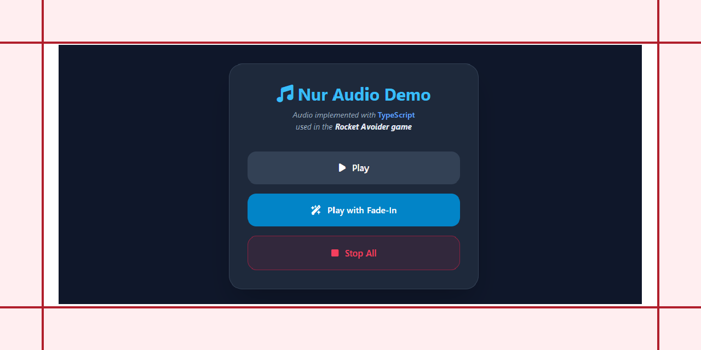

<div align="center">
  
  <h1>nur-audio-library</h1>
</div>

---

A lightweight TypeScript helper library for managing web audio elements with smooth transitions.

🔗 **Live Demo:** [https://nurjamilahh.github.io/nur-audio-library/](https://nurjamilahh.github.io/nur-audio-library/)


---

## Features

- **`stopAllAudio`**: Instantly pauses all `<audio>` elements in the DOM and resets their playback time to zero.
- **`fadeInAudio`**: Plays a specific audio element with a gradual volume increase to prevent sudden loud sounds.
- **TypeScript Ready**: Full type support for `HTMLAudioElement`.

---

## Installation & Setup

1. **Clone the repository** or copy the `js/audio-helper.ts` file into your project.
2. **Compile TypeScript** (if needed):

   ```bash
   npx tsc
   ```

   The compiled JavaScript will be located in the `dist/` folder.

---

## Usage

1. **Importing the Library**

   **Using TypeScript (Source):**

   ```typescript
   import { fadeInAudio, stopAllAudio } from "./js/audio-helper";
   ```

   **Using JavaScript in Browser (Build):**

   ```javascript
   import { fadeInAudio, stopAllAudio } from "./dist/audio-helper.js";
   ```

2. **Implementation Example**

   ```
   const myAudio = document.getElementById("bg-music") as HTMLAudioElement;

   // Play audio with a smooth fade-in to 70% volume
   fadeInAudio(myAudio, 0.7);

   // Optional: Use this if you need to stop all other sounds manually
   // stopAllAudio();
   ```

---

## API Reference

### `fadeInAudio` Parameters

The `fadeInAudio` function accepts the following arguments to customize the transition:

| Parameter      | Type               | Default    | Description                                      |
| :------------- | :----------------- | :--------- | :----------------------------------------------- |
| `audio`        | `HTMLAudioElement` | _Required_ | The audio element to be played.                  |
| `targetVolume` | `number`           | _Required_ | Final volume level (range 0.0 to 1.0).           |
| `step`         | `number`           | `0.01`     | The amount of volume increase per interval.      |
| `interval`     | `number`           | `100`      | Delay between volume increments in milliseconds. |

---

## Folder Structure

- **js/**: Contains the original TypeScript source code (audio-helper.ts).
- **dist/**: Contains the compiled production-ready JavaScript files.
- **assets/**: Contains audio files (e.g., rocket-396890.mp3).
- **index.html**: A demo page to test the audio functions.

---

## License

This project is licensed under the MIT License - feel free to use it in your own projects!

---

## Contact

[](mailto:worknurjam@gmail.com)
[](https://wa.me/6285782602672)
Project Link: [https://github.com/nurjamilahh/nur-audio-library](https://github.com/nurjamilahh/nur-audio-library)

---

_This is part of the **Nurjam Projects** collection — exploring code, one experiment at a time._
